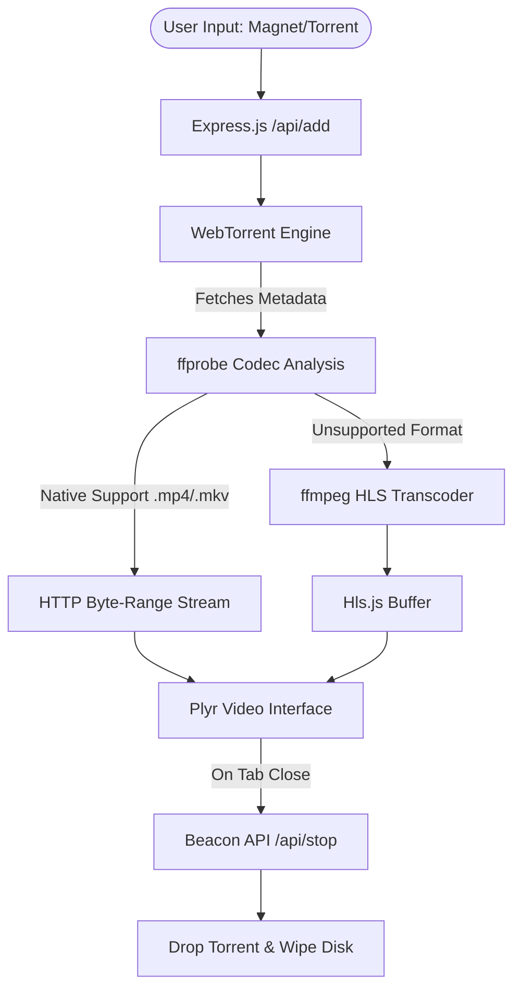

# 🎬 TorrentFlix

> Lightning-fast, lightweight web application for instant magnet and torrent video streaming.

TorrentFlix is a highly optimized, dependency-light web application that allows you to instantly stream video files from magnet links or `.torrent` files directly in your browser. No waiting for full downloads—just paste your link and start watching immediately.


---

## ✨ Features

* **Instant Streaming**: Start watching videos within seconds of pasting a magnet link.
* **Smart Format Handling**: Streams web-friendly formats (`.mp4`, `.webm`, `.mkv`) natively using HTTP byte-range requests for zero-latency random-access seeking.
* **On-the-Fly Transcoding**: Automatically detects unsupported formats (`.avi`, unsupported codecs) and transcodes them in real-time into HTTP Live Streaming (HLS).
* **Sleek, Premium UI**: Beautiful, responsive, dark-themed custom video player powered by `Plyr`.
* **Aggressive Resource Management**: Built-in background sweepers automatically clean up disk space and terminate active torrent connections the exact millisecond a stream is abandoned.
* **API & Automated Tests**: Ships with a fully automated Jest test suite to ensure API stability and background sweeper reliability.

---

## 📸 Demo


*(Placeholder for actual screenshot)*

---

## ❓ Why This Project?

**The Problem**: Downloading large video torrents takes time. Traditional torrent clients require you to download the entire file before watching, or they offer clunky, unreliable sequential streaming with poor format support.  
**The Limitations**: Existing web-based torrent streamers either lack support for modern codecs, fail to seek properly in partially downloaded files, or leak disk space by failing to clean up abandoned streams.  
**The Solution**: TorrentFlix solves this by combining `webtorrent` with intelligent format probing via `ffprobe`. If a browser can play it natively, it uses native byte-range requests for instant seeking anywhere in the file. If not, it falls back to a highly optimized `ffmpeg` HLS pipeline. It pairs this with aggressive, automated cleanup routines.

---

## 🏛️ Architecture

TorrentFlix utilizes a smart routing architecture to determine the fastest, most efficient way to deliver video to the client's browser.



---

## 💻 Tech Stack

### Frontend
* Vanilla JavaScript (ES6+)
* HTML5 / CSS3
* **Plyr**: Premium customized video interface.
* **Hls.js**: HTTP Live Streaming client for transcoded video segments.

### Backend
* **Node.js**: Asynchronous event-driven backend.
* **Express.js**: REST API and static file serving.
* **WebTorrent**: BitTorrent over WebRTC/TCP/UDP.
* **FFmpeg / FFprobe**: On-the-fly video transcoding and codec analysis.

### Testing
* **Jest**: Test runner.
* **Supertest**: HTTP assertion library.

---

## 📁 Project Structure

```text
torrent-flix/
├── public/                 # Frontend assets
│   ├── app.js              # Core frontend logic & player initialization
│   ├── index.html          # Main UI
│   └── style.css           # Custom dark-theme styling
├── server/                 # Backend logic
│   ├── cleanup.js          # Idle sweepers & shutdown handlers
│   ├── config.js           # Constants & environment config
│   ├── index.js            # Express server entry point
│   ├── stream.js           # Native byte-range streaming logic
│   ├── torrent.js          # WebTorrent engine manager
│   └── transcode.js        # ffmpeg HLS generation & probing
├── test/                   # Automated tests
│   ├── api.test.js         # API endpoint tests
│   └── torrent.test.js     # Tracker/sweeper unit tests
├── package.json            # Dependencies & scripts
└── README.md               # Project documentation
```

---

## 🛠️ Installation

### Prerequisites
* Node.js v18.0.0 or higher
* npm or yarn

### Clone Repository
```bash
git clone https://github.com/AnandkumarMall/TorrentFlix.git
cd TorrentFlix
```

### Install Dependencies
```bash
npm install
```

### Run Application
Start the application in production mode:
```bash
npm start
```

For development with live reloading:
```bash
npm run dev
```

The application will be available at `http://localhost:8000`.

---

## 📖 Usage

### Streaming via Web UI
1. Navigate to `http://localhost:8000`.
2. Paste a valid Magnet URL into the input field or drag and drop a `.torrent` file directly onto the page.
3. Click **Stream**.
4. The backend will instantly resolve the metadata and begin streaming the video.

---

## ⚙️ Configuration

You can tweak core behaviors by modifying `server/config.js`.

| Variable | Description | Default |
|----------|-------------|---------|
| `PORT` | The port the Express server listens on. | `8000` |
| `TMP_DIR` | Directory where downloaded chunks and HLS segments are temporarily stored. | `./tmp` |
| `IDLE_TIMEOUT` | Time in milliseconds before an abandoned torrent is deleted from disk. | `5000` (5s) |

---

## 🔌 API Documentation

| Endpoint | Method | Description | Payload |
|----------|--------|-------------|---------|
| `/api/add` | POST | Adds a magnet link and returns torrent metadata. | `{ "magnet": "magnet:?xt=..." }` |
| `/api/upload` | POST | Uploads a `.torrent` file and returns metadata. | `multipart/form-data` |
| `/api/play/:hash/:idx`| GET | Returns the optimal streaming strategy (Native or HLS) for a file. | N/A |
| `/api/status/:hash` | GET | Returns live download progress, speed, and peer count. | N/A |
| `/api/stop/:hash` | POST | Forcefully terminates a torrent and cleans up temporary files. | N/A |

---

## ⚡ Performance

* **Startup Latency**: Metadata resolution typically occurs in < 3 seconds depending on DHT health.
* **Seeking Latency (Native)**: Instantaneous.
* **Transcoding CPU Usage**: `ffmpeg` is optimized with `-preset ultrafast`, maintaining ~20-30% CPU utilization on modern multicore processors during active HLS generation.

---

## 🔒 Security

* **Path Traversal Protection**: HLS endpoints enforce strict regex validation (`/^[\w.-]+$/`) on requested filenames.
* **Memory Limits**: Multer is configured to reject torrent files larger than 10MB to prevent memory exhaustion attacks.
* **Graceful Shutdowns**: `SIGINT`/`SIGTERM` handlers ensure all temporary files and active sockets are destroyed if the server is killed.

---

## 🧪 Testing

The project uses Jest for automated testing.

Run the test suite:
```bash
npm run test
```

*Note: The test script automatically uses `--forceExit` to handle slow WebTorrent UDP socket teardowns.*

---

## 🗺️ Roadmap

* [x] Core Magnet/Torrent downloading
* [x] On-the-fly HLS Transcoding
* [x] Native MKV/MP4 byte-range support
* [x] Automated Resource Cleanup
* [x] Test coverage
* [ ] Support for multiple subtitles / audio tracks
* [ ] Persistent library / watch history
* [ ] Docker containerization

---

## 🤝 Contributing

We welcome contributions! Please follow these steps:

1. Fork the Project
2. Create your Feature Branch (`git checkout -b feature/AmazingFeature`)
3. Commit your Changes (`git commit -m 'Add some AmazingFeature'`)
4. Push to the Branch (`git push origin feature/AmazingFeature`)
5. Open a Pull Request

---

## ❓ FAQ

**Q: Can I stream 4K videos?**  
A: Yes. If the video is supported natively by your browser (e.g., MP4/MKV with H264), 4K streaming uses very little CPU. If transcoding is required, you will need a powerful CPU.

**Q: Where are the files saved?**  
A: Files are saved temporarily in the `./tmp` directory and are automatically wiped by the background sweeper as soon as you close the browser tab.

---

## ⚖️ License

Distributed under the MIT License.

---

## 👏 Acknowledgements

* [WebTorrent](https://webtorrent.io/)
* [Plyr](https://plyr.io/)
* [Hls.js](https://github.com/video-dev/hls.js/)
* [FFmpeg](https://ffmpeg.org/)
